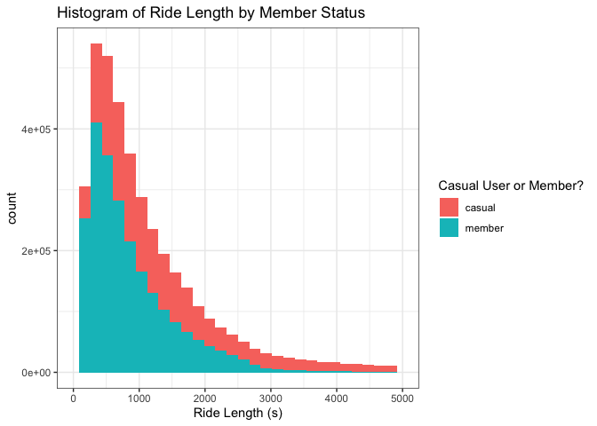
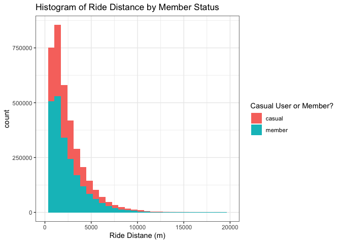
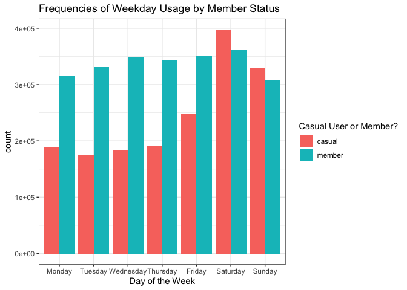

Case Study 1
================
Corey Neff
7/2/2021

# Case Study 1: How Does a Bike-Share Navigate Speedy Success?

## Introduction

**Scenario**

You are a junior data analyst working in the marketing analyst team at
Cyclistic, a bike-share company in Chicago. The director of marketing
believes the company’s future success depends on maximizing the number
of annual memberships. Therefore, your team wants to understand how
casual riders and annual members use Cyclistic bikes differently. From
these insights, your team will design a new marketing strategy to
convert casual riders into annual members. But first, Cyclistic
executives must approve your recommendations, so they must be backed up
with compelling data insights and professional data visualizations.

### The Task at Hand

How do annual members at casual users of Cyclistic differ in their usage
of the company’s bikes?

### Description of the Data

There are 12 monthly datasets, together equal to an entire year,
detailing bike usage. Each dataset contains the following variables:

1.  De-identified Rider ID
2.  Type of bike used
3.  When the bike was rented
4.  When the bike was returned
5.  What station the bike was rented from
6.  The station ID that the bike was rented from
7.  What station the bike was returned to
8.  The station ID that the bike was returned to
9.  The starting latitude
10. The starting longitude
11. The ending latitude
12. The ending longitude
13. Member status

There don’t seem to be any credibility issues with the data, as it was
taken automatically from bike usage. There are some issues with some
variables though.

``` r
librarian::shelf(dplyr, purrr, data.table, lubridate, ggplot2, geosphere, rlist)
```

    ## 
    ##   The 'cran_repo' argument in shelf() was not set, so it will use
    ##   cran_repo = 'https://cran.r-project.org' by default.
    ## 
    ##   To avoid this message, set the 'cran_repo' argument to a CRAN
    ##   mirror URL (see https://cran.r-project.org/mirrors.html) or set
    ##   'quiet = TRUE'.

``` r
mydata <- do.call(rbind, lapply(list.files(pattern="*.csv"), fread))
head(mydata)
```

    ##             ride_id rideable_type          started_at            ended_at
    ## 1: 8CD5DE2C2B6C4CFC   docked_bike 2020-06-13 23:24:48 2020-06-13 23:36:55
    ## 2: 9A191EB2C751D85D   docked_bike 2020-06-26 07:26:10 2020-06-26 07:31:58
    ## 3: F37D14B0B5659BCF   docked_bike 2020-06-23 17:12:41 2020-06-23 17:21:14
    ## 4: C41237B506E85FA1   docked_bike 2020-06-20 01:09:35 2020-06-20 01:28:24
    ## 5: 4B51B3B0BDA7787C   docked_bike 2020-06-25 16:59:25 2020-06-25 17:08:48
    ## 6: D50DF288196B53BE   docked_bike 2020-06-17 18:07:18 2020-06-17 18:18:14
    ##             start_station_name start_station_id         end_station_name
    ## 1:    Wilton Ave & Belmont Ave              117 Damen Ave & Clybourn Ave
    ## 2:        Federal St & Polk St               41       Daley Center Plaza
    ## 3:          Daley Center Plaza               81   State St & Harrison St
    ## 4:     Broadway & Cornelia Ave              303    Broadway & Berwyn Ave
    ## 5: Sheffield Ave & Webster Ave              327 Wilton Ave & Belmont Ave
    ## 6: Sheffield Ave & Webster Ave              327 Wilton Ave & Belmont Ave
    ##    end_station_id start_lat start_lng  end_lat   end_lng member_casual
    ## 1:            163  41.94018 -87.65304 41.93193 -87.67786        casual
    ## 2:             81  41.87208 -87.62954 41.88424 -87.62963        member
    ## 3:              5  41.88424 -87.62963 41.87405 -87.62772        member
    ## 4:            294  41.94553 -87.64644 41.97835 -87.65975        casual
    ## 5:            117  41.92154 -87.65382 41.94018 -87.65304        casual
    ## 6:            117  41.92154 -87.65382 41.94018 -87.65304        casual

### Cleaning the Data

The data was quite clean, initially, and did not need much change. Most
notably, it was sometimes the case that the starting time was *after*
the ending time, which is impossible. This was handled by assigning
these values as NA. had I know what mechanism caused this oversight, I
could have corrected the data, but without knowing it is best to remove
the values entirely.

Additionally, a number of variables were created.

1.  *Distance* = The distance between the starting and ending
    coordinates.
2.  *Ride\_length* = The difference between the starting and ending
    times.
3.  *Day* = The weekday that the bike was rented on.

``` r
mydata <- mydata %>% 
      select(-c(ride_id, start_station_name, end_station_name)) %>%
      mutate(distance = distHaversine(as.matrix(cbind(mydata$start_lng, mydata$start_lat)), as.matrix(cbind(mydata$end_lng, mydata$end_lat))),
             ride_length = as.numeric(ended_at-started_at),
             ended_at = ymd_hms(ended_at),
             started_at = ymd_hms(started_at),
             day = factor(weekdays(started_at), c("Monday", "Tuesday", "Wednesday", "Thursday","Friday", "Saturday", "Sunday")),
             member_casual = as.factor(member_casual))

mydata$ride_length <- replace(mydata$ride_length, which(mydata$ride_length < 0), NA)
```

### Analysis

The analysis was very simple. Since the goal was to determine difference
in usage among members and casual users, descriptive statistics grouped
by this variable should be sufficient.

It seems that casual users tend to ride for much longer, but less often.
For both groups, the most often day to ride a bike was on a Saturday,
and the most common month was in August. Finally, it seems members tend
to ride a slightly longer distance compared to causal users.

``` r
mydata %>% group_by(member_casual) %>%
      summarise(Mean_length = mean(ride_length, na.rm = T),
                Mode_weekday = DescTools::Mode(day),
                Mode_month = DescTools::Mode(month(started_at, label = T)),
                Mean_distance = mean(distance, na.rm = T))
```

    ## # A tibble: 2 x 5
    ##   member_casual Mean_length Mode_weekday Mode_month Mean_distance
    ##   <fct>               <dbl> <fct>        <ord>              <dbl>
    ## 1 casual              2562. Saturday     Aug                2188.
    ## 2 member               930. Saturday     Aug                2251.

### Visualizations

<!-- -->

From this histogram, we can see that most users are not members.
Additionally, we can see that casual users tend to ride for a slightly
longer amount of time.

<!-- -->

This histogram tells a similar story. We can see that most users are,
again, not members. Since there are more casual users, it appears they
may be riding further on average, but this may not be the case. I
suspect that if the population sizes of these two groups were equal then
the histograms would be nearly identical. Therefore, member status does
not seem to directly influence how far someone is willing to ride on the
bike.

<!-- -->

This visual tells an interesting story. Member bike usage is much less
dependent on the day of the week than for casual users. Casual bike
users have greatly increased demand at the end of the week compared to
members.

### Recommendations

Generally speaking, casual users ride for a longer duration but also
less often. To encourage them to enroll, here are some simple
recommendations:

1.  Incentivize casual users to enroll as a member by providing
    discounts based on length of time used.
2.  Have weekend specials reducing the cost for members only,
    encouraging casual users to enroll.
3.  Introduce a “reservation” system allowing members to schedule a bike
    ahead of time during busy periods (e.g. Saturdays or August),
    effectively being able to skip the line during high-demand times.
4.  Provide discounts for returning usage, like a stamp card.
